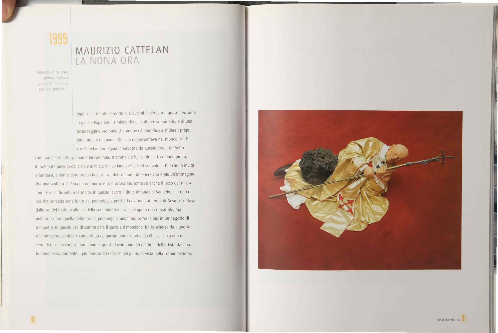

# ARCHITECTURE.md — Guida per Chat AI e Contributori

> [!IMPORTANT]
> ### REGOLA OBBLIGATORIA PER CHAT AI E SVILUPPATORI
> **Dopo ogni cambiamento importante, refactoring o aggiunta di nuove funzionalità al progetto, è OBBLIGATORIO aggiornare questo file (`ARCHITECTURE.md`) prima di concludere il compito.**
> 
> Tutte le istruzioni operative per le chat AI risiedono **esclusivamente in questo file**. Il file `README.md` è riservato alla sola descrizione pubblica per GitHub e non deve contenere istruzioni o prompt per l'agente.

---

Questo file spiega **come funziona l'architettura del progetto**, le convenzioni adottate, come operare e come estendere la piattaforma.
È pensato per essere letto da qualsiasi chat AI (Gemini, Claude, GPT) o sviluppatore prima di apportare modifiche.

---

## 1. Struttura del progetto

```
Studio/
├── index.html              ← Home: selezione Corso → Anno → Materia (con filtri per anno)
├── styles.css              ← Design system unificato, variabili tema, componenti UI
├── README.md               ← Presentazione pubblica repository per GitHub
├── ARCHITECTURE.md         ← QUESTO FILE: Regole operative e architettura tecnica
│
├── js/
│   ├── core.js             ← Modulo condiviso StudyCore: stato globale, persistenza,
│   │                          TTS audio reader (Google Italiano), sync tema cross-tab,
│   │                          markdown parser, flashcard, quiz, esame, backup/import
│   ├── app-ux.js           ← Logica specifica per Web Design (gestione dispense, stats)
│   └── app-arte.js         ← Logica specifica per Storia dell'Arte Contemporanea 2
│
├── pages/
│   ├── ux-webdesign.html   ← Pagina Web Design (carica core.js + app-ux.js)
│   └── storia-arte.html    ← Pagina Storia dell'Arte Contemporanea 2 (carica core.js + app-arte.js)
│
├── data/
│   ├── dispense-data.js    ← Dispense Professore (14 capitoli)
│   ├── krug-data.js        ← Steve Krug — Don't Make Me Think (14 capitoli)
│   ├── stull-data.js       ← Edward Stull — UX Design con storie àncora (43 capitoli)
│   ├── maeda-data.js       ← John Maeda — Le leggi della semplicità (13 capitoli)
│   ├── glossary-data.js    ← Glossario termini tecnici UX
│   └── arte-data.js        ← Storia dell'Arte Contemporanea 2 (tutti i moduli)
│
├── assets/
│   ├── logo.svg            ← Logo esteso ABA Catania (pittogramma stella + testo)
│   ├── logo-icon.svg       ← Pittogramma icona stella ABA Catania (versione isolata SVG)
│   ├── icons/              ← Icone SVG vettoriali
│   └── arte/               ← Immagini opere d'arte per modulo Storia dell'Arte
│
├── Web Design/             ← Materiale sorgente PDF (non servito dal sito web)
└── Storia dell'Arte/       ← Materiale sorgente PDF (non servito dal sito web)
```

---

## 2. Come aggiungere un NUOVO CORSO

I corsi di laurea sono definiti in `index.html` nella variabile `CORSI` dentro il tag `<script>`.

Per aggiungere un nuovo corso con contenuti:

1. Nel file `index.html`, trova l'array `CORSI.triennio` o `CORSI.biennio`
2. Imposta `hasContent: true` e aggiungi un `accent` (colore hex per quel corso)
3. Crea la variabile `ANNI_NOMECORSO` con gli anni e le materie (segui il modello `ANNI_NTA`)

Esempio:
```javascript
{ code: 'DAPL04', name: 'Grafica, illustrazione', hasContent: true, accent: '#4CAF50' }
```

---

## 3. Come aggiungere un NUOVO ANNO

Nell'array degli anni del corso (es. `ANNI_NTA` in `index.html`), aggiungi un oggetto:

```javascript
{ num: 4, label: '4° Anno', materie: [] }
```

Quando avra' materie, popola l'array `materie` (vedi sezione 4).

---

## 4. Come aggiungere una NUOVA MATERIA

### 4.1. Creare il file dati

Crea un file `data/nome-materia-data.js` con questa struttura:

```javascript
window.NOME_MATERIA_DATA = [
  {
    id: "nome-c1",              // ID univoco (usato in localStorage)
    number: 1,                  // Numero capitolo
    title: "Titolo Capitolo",   // Titolo del capitolo
    subtitle: "",               // Sottotitolo opzionale
    readTime: "10 min",         // Tempo stimato di lettura
    partNum: null,              // Numero parte (opzionale, per libri divisi)
    partTitle: null,            // Titolo parte (opzionale)
    module: "modulo1",          // ID modulo per raggruppamento
    
    // Sintesi: MARKDOWN formattato. Deve essere FEDELE al testo originale.
    summary: "## Sezione\n\nTesto della sintesi...\n\n**Concetto chiave**: ...",
    
    // Punti chiave per l'esame
    keyPoints: [
      "Punto chiave 1 da sapere all'esame",
      "Punto chiave 2"
    ],
    
    // Flashcard (5-8 per capitolo)
    flashcards: [
      {
        question: "Domanda precisa sul contenuto del capitolo",
        answer: "Risposta completa e accurata basata sul testo"
      }
    ],
    
    // Quiz (5-8 per capitolo)
    quiz: [
      {
        question: "Domanda a scelta multipla",
        options: [
          "Opzione A (corretta)",
          "Opzione B",
          "Opzione C",
          "Opzione D"
        ],
        correctIndex: 0,
        explanation: "Spiegazione didattica con riferimento al testo originale"
      }
    ],
    
    // Quiz extra per il simulatore d'esame (opzionale)
    examQuiz: []
  }
  // ... altri capitoli
];
```

### 4.2. Creare il file JS della logica

Copia `js/app-ux.js` come template. Modifica:
- `getCurrentPdfChapters()` per mappare i moduli della nuova materia
- `getPdfDisplayName()` per i nomi visualizzati
- `getExamPool()` per il pool di domande del simulatore
- `updateProgressIndicators()` per i badge di progresso

### 4.3. Creare la pagina HTML

Copia `pages/ux-webdesign.html` come template. Modifica:
- Il `<title>` e `<meta description>`
- Le tab nella `<nav class="pdf-selector">` per i moduli della nuova materia
- I tag `<script>` in fondo per caricare i file dati corretti e il file JS specifico

### 4.4. Registrare la materia nella home

In `index.html`, aggiungi la materia nell'array `materie` dell'anno corrispondente:

```javascript
{
  id: 'nome-materia',
  name: 'Nome Materia Completo',
  desc: 'Descrizione breve...',
  icon: 'code',  // chiave dell'oggetto ICONS
  stats: { capitoli: 10, quiz: 50, fonti: 2 },
  page: 'pages/nome-materia.html'
}
```

---

## 5. Come estrarre dati da un PDF

### IMPORTANTE: Questo materiale serve per studiare per gli esami universitari. La qualita' e la fedelta' al testo originale sono CRITICHE.

### Processo step-by-step

1. **Estrai il testo raw dal PDF**
   - Usa un tool come `pdftotext`, `PyPDF2`, o manualmente
   - Salva in un file `.txt` temporaneo

2. **Analizza la struttura del testo**
   - Identifica capitoli, sezioni, sottosezioni
   - Nota la gerarchia: libro → parti → capitoli → sezioni
   - Identifica concetti chiave, definizioni, tabelle, citazioni

3. **Genera il dataset JS**
   - Per OGNI capitolo, crea un oggetto con lo schema descritto in sezione 4.1
   - La `summary` deve essere:
     - **Fedele al testo originale** (non inventare contenuti)
     - **Completa**: includi TUTTE le informazioni rilevanti
     - **Formattata in markdown**: usa ##, **, *, \`code\`, tabelle |...|
     - **Con immagini se disponibili**: ``
   - Le `flashcards` devono:
     - Coprire i concetti principali del capitolo
     - Avere domande specifiche (non generiche)
     - Avere risposte complete ma concise
   - I `quiz` devono:
     - Avere 4 opzioni di cui 1 sola corretta
     - Le opzioni errate devono essere plausibili
     - La `explanation` deve citare il testo originale
     - `correctIndex` deve essere l'indice (0-based) dell'opzione corretta

4. **Verifica**
   - Controlla che ogni capitolo abbia: summary, keyPoints, flashcards (5+), quiz (5+)
   - Testa nel browser che tutto si carichi correttamente
   - Verifica che il parser markdown renda correttamente tabelle, codice, immagini

### Formato immagini per Arte

Le immagini vanno salvate in `assets/arte/` con naming:
```
cognome_opera.jpg
cognome_p{pagina}_{indice}.jpg
```
Esempio: `cattelan_la_nona_ora.jpg`, `eliasson_p1_0.jpg`

Referenziate nel markdown della summary con path relativo:
```markdown

```

---

## 6. Convenzioni

### ID capitoli
- Formato: `{fonte}-c{numero}` o `{fonte}-{modulo}-c{numero}`
- Esempi: `dispense-c1`, `stull-c14`, `arte-anni80-c3`, `arte-monografie-hirst-c1`

### ID per localStorage
- Chiave principale: `ux_web_study_state_v1`
- I progressi sono salvati con `completed[chapId] = true`
- Le flashcard con `flashcardStatus[cardId] = 'known' | 'cram'`
- I quiz con `quizAnswers[quizId] = { selectedIndex, isCorrect }`

### Icone
- **MAI usare emoji**. Usare sempre icone SVG inline
- Per icone comuni, usare l'oggetto `StudyCore.ICONS` in `js/core.js`
- Per icone nuove, usare SVG da [Lucide Icons](https://lucide.dev/) con `stroke="currentColor"`
- Le icone devono essere colorabili via CSS con il colore accento del corso

### Colori accento per corso
- NTA (DAPL08): `#feb940`
- Altri corsi: da definire quando vengono creati
- Il colore accento si applica con la variabile CSS `--course-accent` in cima alla pagina della materia

### Naming ufficiale materie e corsi
- **Fedeltà al piano di studi ABA Catania**: i nomi delle materie devono corrispondere ESATTAMENTE ai corsi ufficiali dell'Accademia (es. da `https://www.abacatania.it/offerta-formativa/dapl08-nuove-tecnologie-dellarte/`):
  - `Web Design` (Codice ABPR 19, 8 CFA — NON "UX & Web Design")
  - `Storia dell'Arte Contemporanea 2` (Codice ABST 47, 6 CFA — NON "Storia dell'Arte")
- Sia il `<title>` della pagina che l'`<h1>` del brand (`#brand-main-title`) devono riportare il nome ufficiale esatto.

### Brand Header e Pulsante Indietro
- Il pulsante Indietro (`#btn-hub-nav`) nelle pagine interne usa la classe `.btn-back-nav`.
- È un pulsante compatto con freccia indietro vettoriale SVG da **18x18px** (`<path d="m12 19-7-7 7-7"/><path d="M19 12H5"/>`), con micro-animazione fluida di traslazione verso sinistra al passaggio del mouse (`transform: translateX(-2px)`).
- Rimanda alla home (`../index.html`) senza appesantire l'header con loghi o scritte ingombranti.

### Tema Chiaro / Scuro e Sincronizzazione Cross-Page
- **Tonalità scure**: il tema scuro deve tendere al nero profondo/neutro (`#0d0f12`, `--bg-primary`), **evitando dominanti bluastre**.
- **Contrasto elevato**: testi secondari e bordi devono sempre essere ben visibili (`--text-secondary: #9aa0a6`).
- **Invarianza degli accenti**: i colori accento dei corsi (come il giallo NTA `#feb940`) devono rimanere brillanti e leggibili sia in tema chiaro che scuro.
- **Sincronizzazione globale**: il tema è salvato nella chiave `localStorage('aba_studio_theme')`. In `core.js` un listener sull'evento `'storage'` sincronizza istantaneamente il tema su tutte le finestre/schede aperte del browser.

### Comportamento Navigazione Dispense
- Quando lo studente passa da una dispensa all'altra nella barra di selezione in alto (`.pdf-selector`):
  1. La vista attiva viene sempre reimpostata su `summary` (Sintesi e Concetti).
  2. Viene cercato e attivato automaticamente il **primo capitolo non completato** di quella specifica dispensa (oppure il capitolo 0 se tutti sono completati).

---

## 7. Sistema Lettore Vocale (TTS)

Il sistema di sintesi vocale è implementato nativamente in `js/core.js` (`StudyCore.speech`):

### Voce Esclusiva
- La voce è configurata tassativamente su **`Google italiano`** tramite `getItalianVoice()`. Non è presente un dropdown di selezione nella UI. Se il browser non ha la voce Google (es. Safari/Firefox), viene effettuato un fallback trasparente alle migliori voci neurali/naturali italiane di sistema.

### Moltiplicatori di Velocità (1x e 1.25x)
- Nella barra audio (`#summary-audio-bar`) sono presenti bottoni dedicati (`.speed-pill`): **`1x`** (velocità normale) e **`1.25x`** (velocità ottimizzata per l'ascolto comprensibile).
- I tasti di velocità hanno la **stessa altezza (32px), tipografia (13px, font-weight 600) e presenza visiva del pulsante "Ascolta Sintesi"**, garantendo perfetto allineamento e coerenza estetica.
- La velocità selezionata viene salvata in `localStorage('aba_tts_speed')`.
- Cliccando su una velocità durante la riproduzione, la lettura si adatta immediatamente riavviando il chunk corrente alla nuova velocità senza perdere il filo.

### Gestione del Testo e Chunking
- `stripMarkdownForSpeech(text)`: rimuove sintassi markdown, blocchi di codice e tabelle per ottenere un discorso fluido.
- `splitIntoSpeechChunks(text)`: suddivide il testo in blocchi leggeri basati sulla punteggiatura. Questo previene i blocchi noti della Web Speech API sui testi lunghi e permette una gestione precisa di pausa/ripresa e indicatore di avanzamento.

---

## 8. Note tecniche

### Perché non un framework?
- Il sito è 100% client-side, zero build step.
- Si apre direttamente con doppio clic su `index.html` o con un server statico locale.
- Zero dipendenze npm a runtime = zero problemi di manutenzione nel tempo.
- Performance e reattività istantanee.

### Persistenza in localStorage
- Stato di studio: `ux_web_study_state_v1`.
- Tema preferito: `aba_studio_theme` (`light` | `dark`).
- Velocità voce: `aba_tts_speed` (`1`, `1.25`, `1.5`, `1.75`, `2`).
- Sistema di backup ed esportazione/importazione JSON integrato.

### Markdown parser
- Il parser in `core.js` (`formatMarkdown()`) gestisce:
  - Heading (##, ###, ####)
  - Bold, italic, inline code
  - Code blocks con syntax highlighting per css, html, js
  - Tabelle markdown complete
  - Blockquote
  - Liste puntate
  - Immagini responsive con figure e caption
  - Divisori orizzontali (---)

